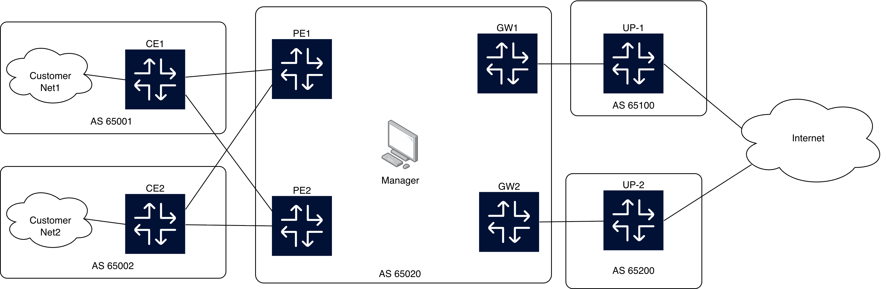

Project for the "**Advanced Computer Networking**" class (2025-26) at Pisa University.<br>
Group work carried out by the students: [Luca Arduini](https://github.com/LucaArduini), [Valerio Triolo](https://github.com/valeriot30).

# 📡 BGP Network Automation & Traffic Engineering

<p align="center">
  
</p>

This repository hosts the final project for the **Advanced Computer Networking** course (2025-2026) at the **University of Pisa**.

The project implements a **fully automated pipeline** for the design, emulation, and dynamic optimization of a Transit Autonomous System (AS65020). It leverages **Containerlab**, **FRRouting (FRR)**, and **Python** to manage configuration lifecycles and perform closed-loop Traffic Engineering (TE) based on mathematical optimization.

---

## 🚀 Project Overview

The goal is to automate the operations of a simplified Service Provider network. The system moves beyond static configurations, introducing a **Manager Node** that acts as an intelligent control plane.

### Key Features
*   **Single Source of Truth:** The entire topology, IP addressing, and relationships are defined in a generic `data.yaml` file.
*   **Automated Configuration:** Jinja2 templates generate valid FRR configurations (`.conf`) for all routers (PEs, CEs, GWs) automatically.
*   **Network Emulation:** One-click deployment using **Containerlab**, simulating a realistic multi-AS environment with Linux Bridges and Docker containers.
*   **Dynamic Traffic Engineering (TE):** A Python-based automation loop that:
    1.  Generates/Ingests traffic matrices.
    2.  Solves **Mixed-Integer Linear Programming (MILP)** models to optimize load balancing.
    3.  Injects BGP policies (**MED** and **Local Preference**) into running routers via `docker exec`.

---

## 🏗️ Network Architecture

The emulated network represents **AS65020**, a transit provider connecting Customers to the Internet.

*   **Core (AS65020):**
    *   **2 Provider Edges (PE1, PE2):** Entry points for customer traffic.
    *   **2 Gateways (GW1, GW2):** Exit points towards Upstream providers.
    *   **Manager Node:** A specialized Alpine container running the Python optimization logic.
*   **Customers:** 2 Customer ASes (CE1, CE2) providing redundancy.
*   **Upstreams:** 2 Upstream Providers connecting to the Internet (simulated by Google/Cloudflare destinations).

---

## 🧠 Traffic Engineering Logic

The core of this project is the `manager.py` script, which performs two sequential optimization stages using `scipy`:

### 1. Ingress Optimization (PE Selection)
*   **Goal:** Balance the load between PE1 and PE2 to prevent entry bottlenecks.
*   **Algorithm:** MILP model minimizing the load difference between PEs.
*   **Actuation:** Manipulates **BGP MED**.
    *   *Selected PE:* MED 100
    *   *Backup PE:* MED 200

### 2. Egress Optimization (Gateway Selection)
*   **Goal:** Optimize the saturation of upstream links (GW to Upstream), respecting different link capacities.
*   **Algorithm:** Minimax Saturation model (MILP).
*   **Actuation:** Manipulates **BGP Local Preference**.
    *   *Selected GW:* Local Preference 200 (Highest wins in iBGP)
    *   *Backup GW:* Local Preference 100

---

## 📂 Project Structure

```text
├── automation/            # Core Python logic (Manager)
│   ├── manager.py         # Main orchestration script
│   ├── build_config.py    # Config generation logic
│   ├── build_topology.py  # Containerlab file generation
│   ├── generate_traffic.py# Synthetic traffic matrix generator
│   └── ...
├── templates/             # Jinja2 templates (frr.conf, topology)
├── tests/                 # Validation scripts (pings, traceroute, te)
├── bootstrap.sh           # VM setup script
├── orchestrator.py        # Deployment pipeline (Local -> VM)
├── install.py             # Dependency installer
└── data.yaml              # Topology Source of Truth
```

---

## 🛠️ Installation & Usage

The workflow is designed to run via an orchestration script that deploys the lab onto a target machine (e.g., a VM or a local Linux host).

### 1. Prerequisites

- **Python** 3.x
- **Docker**
- **Containerlab** (installed on the target machine)

### 2. Setup (Host Machine)

Install local Python dependencies:

```bash
python3 install.py
```

### 3. Deploy and Run

The `orchestrator.py` script handles artifact generation, file synchronization, and startup.

```bash
# Run the orchestration pipeline
python3 orchestrator.py
```

This script will generate configurations, copy files to the target environment, build the custom Manager container, and start the topology.

### 4. Execute Traffic Engineering

Once the lab is running, execute the optimization loop inside the Manager container:

```bash
docker exec -it clab-project-manager sh

# Inside the container:
python3 manager.py
```

This will generate traffic, compute optimal paths, and apply Route Maps to the routers.

---

## 🧪 Testing & Validation

The `tests/` directory contains scripts to verify the network state.

### Connectivity Check

Verifies end-to-end reachability (ICMP):

```bash
python3 tests/pings.py
```

### TE Validation

Performs traceroute analysis to confirm that packets follow the mathematically optimized paths (verifying MED and LocalPref effects):

```bash
python3 tests/te.py
```

---

## 🧹 Cleanup

To stop the emulation and clean up all containers and network bridges:

```bash
# On the remote server
sudo containerlab destroy -t topology/network.clab.yml --cleanup-all
```
